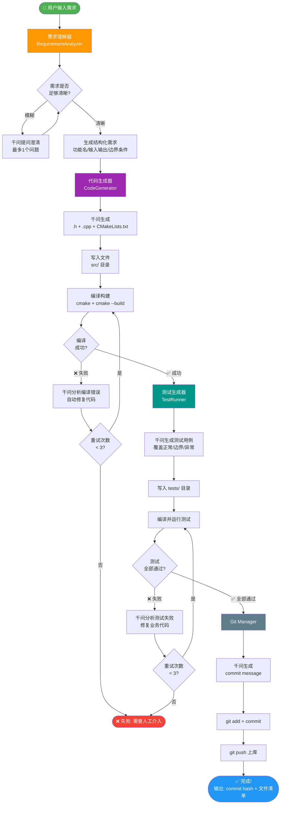

# C++ 自主开发 Agent —— 图文全解

## 一、它能做什么？

你输入一句话（哪怕很模糊）：

```
"实现一个线程安全的消息队列"
```

Agent 全自动完成：

```
理解需求 → 生成C++代码 → 编译 → 自测试 → 修复Bug → 上库(git commit)
```

全程无需人工干预。

---

## 二、系统总体架构

```
┌─────────────────────────────────────────────────────────────────┐
│                      C++ Dev Agent 系统                          │
│                                                                  │
│  ┌──────────┐   ┌──────────┐   ┌──────────┐   ┌──────────┐    │
│  │  需求     │   │  代码     │   │  编译     │   │  测试     │    │
│  │ 理解器    │──▶│ 生成器    │──▶│ 构建系统  │──▶│ 运行器    │    │
│  │Analyzer  │   │Generator │   │  Builder │   │  Runner  │    │
│  └────┬─────┘   └────┬─────┘   └────┬─────┘   └────┬─────┘    │
│       │              │              │               │           │
│       └──────────────┴──────────────┴───────────────┘           │
│                             │                                    │
│              ┌──────────────▼─────────────────┐                 │
│              │      通义千问 (Qwen API)          │                 │
│              │  理解 / 生成 / 分析错误 / 修复     │                 │
│              └────────────────────────────────┘                 │
│                                                                  │
│  ┌──────────────────────────────────────────────────────────┐   │
│  │                  Git Manager                              │   │
│  │           git add → commit → push → 上库完成              │   │
│  └──────────────────────────────────────────────────────────┘   │
└─────────────────────────────────────────────────────────────────┘
```

---

## 三、完整执行流程图



---

## 四、各模块职责详解

### 模块1：需求理解器 (RequirementAnalyzer)

```
输入：  "实现一个LRU缓存"（自然语言，可以很模糊）
           ↓
        千问分析：
        - 功能是什么？LRU Cache
        - 接口是什么？get(key) / put(key, value)
        - 边界条件？容量满时淘汰最久未使用项
        - 需要澄清？容量是否固定 → 询问用户
           ↓
输出：  结构化需求JSON
        {
          "feature_name": "lru_cache",
          "description": "...",
          "inputs": [...],
          "outputs": [...],
          "edge_cases": [...]
        }
```

### 模块2：代码生成器 (CodeGenerator)

```
输入：  结构化需求JSON
           ↓
        使用 qwen-coder-plus（专门的代码模型）
        生成3个文件：
        ├── src/lru_cache.h      ← 类定义 + 接口
        ├── src/lru_cache.cpp    ← 完整实现
        └── CMakeLists.txt       ← 构建配置
           ↓
输出：  写入磁盘
```

### 模块3：编译构建 (BuildSystem)

```
执行命令：
  cmake -S . -B build          ← 配置
  cmake --build build          ← 编译

成功 → 继续
失败 → 把错误信息发给千问：
       "以下编译错误如何修复？error: ..."
       千问返回修复后的代码
       重试（最多3次）
```

### 模块4：测试运行器 (TestRunner)

```
输入：  业务代码 + 需求描述
           ↓
        千问生成测试文件 tests/test_lru_cache.cpp：
        - 正常功能测试（put/get）
        - 边界测试（容量=1, 容量=0）
        - 异常测试（key不存在返回-1）
           ↓
        编译并运行测试：
        cmake --build build --target run_tests
        ctest --output-on-failure
           ↓
成功 → 继续上库
失败 → 千问分析失败原因 → 修复业务代码 → 重新测试
```

### 模块5：Git管理器 (GitManager)

```
操作：
  1. git add src/ tests/ CMakeLists.txt
  2. 千问生成规范commit message：
     "feat: implement LRU cache with O(1) get/put"
  3. git commit -m "..."
  4. git push origin main（可配置是否自动push）
```

---

## 五、文件目录结构

```
cpp_agent/                     ← Agent 代码（Python）
├── config.py                  ← API密钥 + 路径配置
├── requirements.txt           ← Python依赖
├── main.py                    ← 启动入口
└── agent/
    ├── __init__.py
    ├── requirement_analyzer.py
    ├── code_generator.py
    ├── build_system.py
    ├── test_runner.py
    ├── git_manager.py
    └── orchestrator.py        ← 主流程编排

workspace/                     ← 生成的C++项目（Git仓库）
└── {功能名}_{时间戳}/
    ├── CMakeLists.txt
    ├── src/
    │   ├── {feature}.h
    │   └── {feature}.cpp
    ├── tests/
    │   └── test_{feature}.cpp
    └── build/                 ← cmake编译输出
```

---

## 六、环境要求

| 工具 | 用途 | 安装方式 |
|------|------|---------|
| Python 3.9+ | 运行Agent | python.org |
| CMake 3.15+ | 构建C++项目 | `winget install cmake` |
| MinGW-w64 / MSVC | C++编译器 | MinGW: `winget install mingw` |
| Git | 版本管理上库 | 已安装 ✓ |
| 通义千问API Key | AI大脑 | 阿里云百炼平台 |

---

## 七、运行效果示例

```
$ python main.py

==============================================
         C++ 自主开发 Agent
         大脑: 通义千问 | 构建: CMake | 上库: Git
==============================================

请输入需求（支持中文，可以模糊描述）：
> 实现一个线程安全的消息队列，支持多生产者多消费者

[Analyzer] 理解需求...
[Analyzer] ✓ 功能: thread_safe_queue
[Analyzer] ✓ 接口: push(msg) / pop() / size() / empty()
[Analyzer] ✓ 边界: 队列满时阻塞/超时，空时阻塞/超时

[Generator] 使用 qwen-coder-plus 生成代码...
[Generator] ✓ 已生成 src/thread_safe_queue.h (47行)
[Generator] ✓ 已生成 src/thread_safe_queue.cpp (89行)
[Generator] ✓ 已生成 CMakeLists.txt

[Builder] cmake 配置中...
[Builder] cmake 编译中...
[Builder] ✓ 编译成功

[TestRunner] 生成测试用例...
[TestRunner] ✓ 已生成 tests/test_thread_safe_queue.cpp (6个测试)
[TestRunner] 运行测试...
[TestRunner] ✓ test_push_pop          PASSED
[TestRunner] ✓ test_concurrent_push   PASSED
[TestRunner] ✓ test_concurrent_pop    PASSED
[TestRunner] ✓ test_empty_queue       PASSED
[TestRunner] ✓ test_capacity_limit    PASSED
[TestRunner] ✓ test_timeout           PASSED
[TestRunner] ✓ 全部 6/6 测试通过

[GitManager] 生成 commit message...
[GitManager] git add + commit...
[GitManager] ✓ 已上库: feat: implement thread-safe MPMC message queue

==========================
✅ 任务完成！
   Commit: a3f7c21
   文件: src/thread_safe_queue.h, src/thread_safe_queue.cpp
   测试: 6/6 通过
   耗时: 42秒
==========================
```
