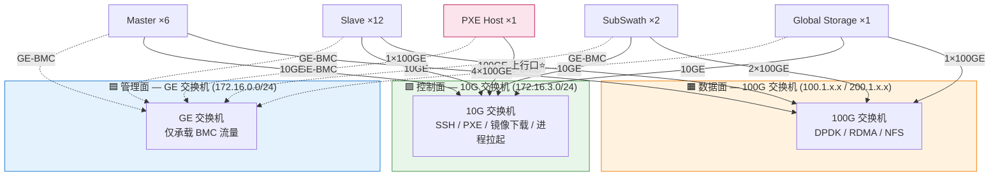
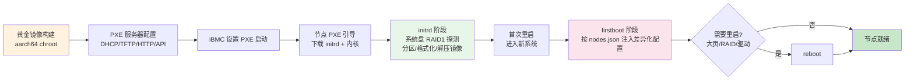
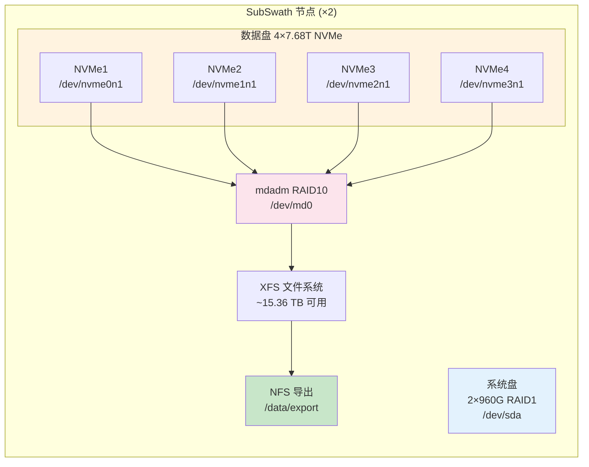
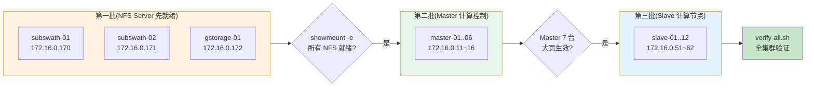

# 22 节点鲲鹏集群 PXE 黄金镜像部署方案 v2

> **版本说明**
> - 目标硬件:华为鲲鹏 ARM64 + HNS 网卡
> - 集群规模:**22 节点**(1 PXE Host + 6 Master + 12 Slave + 2 SubSwath + 1 Global Storage)
> - 网络架构:**三平面物理隔离**(管理面 GE / 控制面 10GE / 数据面 100GE)
> - 镜像方案:**黄金镜像 base.tar.zst** + **firstboot 差异化注入**
> - 修订基础:对照新版 SVG 组网图,在原 v1 方案上重做网络规划与硬件配置部分

---

## 目录

- [0 与 v1 方案的核心变更](#0-与-v1-方案的核心变更)
- [1 集群总体架构](#1-集群总体架构)
- [2 IP 与网段规划](#2-ip-与网段规划)
- [3 硬件配置](#3-硬件配置)
- [4 部署前准备:iBMC 与 UEFI 配置](#4-部署前准备ibmc-与-uefi-配置)
- [5 黄金镜像构建(aarch64)](#5-黄金镜像构建aarch64)
- [6 PXE 服务器配置](#6-pxe-服务器配置)
- [7 极简部署 initrd](#7-极简部署-initrd)
- [8 firstboot 脚本体系](#8-firstboot-脚本体系)
- [9 部署顺序与操作步骤](#9-部署顺序与操作步骤)
- [10 验证与运维](#10-验证与运维)

---

## 0 与 v1 方案的核心变更

| # | 维度 | v1(原方案) | v2(新组网图) | 影响范围 |
|---|---|---|---|---|
| 1 | **集群规模** | 23 节点(Master 7) | **22 节点(Master 6)** | 批量脚本、主机名表 |
| 2 | **网络平面** | 平面合并描述,边界模糊 | **三平面物理隔离**:管理面 GE / 控制面 10GE / 数据面 100GE | 整体拓扑、DHCP |
| 3 | **管理面网段** | 192.168.0.0/24(BMC) | **172.16.0.0/24** | DHCP、批量启动脚本 |
| 4 | **控制面网段** | 10.0.0.0/24 | **172.16.3.0/24** | nodes.json 全字段 |
| 5 | **管理面交换机** | 与控制面合并 | **独立 GE 交换机**(只管 BMC) | 新增物理设备 |
| 6 | **PXE Host 上行** | 1×10G 管理口 | **100GE 上行至 10G 交换机的 100GE 端口** | 物理接线、镜像分发吞吐 |
| 7 | **Slave 100G IP** | 末位 21~32 | **末位 51~62** | nodes.json |
| 8 | **存储节点 100G IP** | 41/42/51 | **170 / 171 / 172** | nodes.json |
| 9 | **NFS 网段** | 独立 172.16.1.0/24 | **取消,合并到 100G 数据面** | NFS 挂载脚本 |
| 10 | **SubSwath 网络** | 2×100G 做 bond | **2×100G 双 IP**(RDMA-1 + RDMA-2 双平面,无 bond) | 20-network.sh |
| 11 | **系统盘** | 单盘(SAS 或 NVMe) | **全角色统一 2×960G SSD 硬件 RAID1** | initrd 部署逻辑 |
| 12 | **SubSwath 数据盘** | 多块 SAS 做 LVM | **4×7.68T NVMe 软件 RAID10** | 55-disks.sh |
| 13 | **GStorage 数据盘** | 多块 SAS 做 LVM | **多块机械硬盘 硬件 RAID50** | 55-disks.sh |

---

## 1 集群总体架构

### 1.1 三平面物理隔离

集群采用**管理面 / 控制面 / 数据面三平面物理隔离**架构,各平面由独立的物理交换机承载,故障域互不影响。



> ⭐ **关键工程点**:PXE Host 的 100GE 网卡直接接入 10G 交换机的 100GE 上行口。
> 这样 PXE Host 自身可以为下游所有 10GE 节点提供线速级镜像分发,
> 避免 22 节点并发 PXE 引导时镜像下载阶段成为带宽瓶颈。

### 1.2 角色与数量

| 角色 | 数量 | 主机名规则 | 说明 |
|---|---|---|---|
| PXE Host | 1 | host-server | DHCP / TFTP / HTTP / node-config API,不参与业务 |
| Master | 6 | master-01 ~ master-06 | DPDK 接收 + RDMA 计算控制 |
| Slave | 12 | slave-01 ~ slave-12 | RDMA 计算 + NFS 客户端 |
| SubSwath | 2 | subswath-01 ~ subswath-02 | NFS Server(子带数据,基于 NVMe) |
| Global Storage | 1 | gstorage-01 | NFS Server(归档,基于机械硬盘) |

### 1.3 整体部署流程



---

## 2 IP 与网段规划

### 2.1 网段总览

| 平面 | 网段 | 用途 | 接入交换机 | 节点接入网口 |
|---|---|---|---|---|
| **管理面** | `172.16.0.0/24` | BMC 带外管理(ipmitool / Web) | GE 交换机 | GE-BMC |
| **控制面** | `172.16.3.0/24` | SSH / PXE / 镜像下载 / 进程拉起 | 10G 交换机 | 10GE LOM |
| 数据面 - DPDK1 | `200.1.1.0/24` | DPDK 接收面 1 | 100G 交换机 | Master eno2 |
| 数据面 - DPDK2 | `200.1.2.0/24` | DPDK 接收面 2 | 100G 交换机 | Master eno3 |
| 数据面 - RDMA1 | `100.1.1.0/24` | RDMA 数据面 1 / NFS-A | 100G 交换机 | Master eno4 / Slave eno2 / SubSwath eno2 |
| 数据面 - RDMA2 | `100.1.2.0/24` | RDMA 数据面 2 / NFS-B | 100G 交换机 | Master eno5 / SubSwath eno3 / GStorage eno2 |

> **IP 编号规则**:管理面与控制面**末位与机器编号一致**(例如 master-05 → BMC `172.16.0.15` / 控制面 `172.16.3.15`),便于运维快速识别。

### 2.2 管理面 + 控制面 IP 表(172.16.x.x)

| 主机名 | BMC (GE) | 控制面 (10GE) | 备注 |
|---|---|---|---|
| host-server | `172.16.0.10` | `172.16.3.10` | PXE Host,**100GE 上行至 10G 交换机** |
| master-01 | `172.16.0.11` | `172.16.3.11` | |
| master-02 | `172.16.0.12` | `172.16.3.12` | |
| master-03 | `172.16.0.13` | `172.16.3.13` | |
| master-04 | `172.16.0.14` | `172.16.3.14` | |
| master-05 | `172.16.0.15` | `172.16.3.15` | |
| master-06 | `172.16.0.16` | `172.16.3.16` | |
| slave-01 | `172.16.0.51` | `172.16.3.51` | |
| slave-02 | `172.16.0.52` | `172.16.3.52` | |
| slave-03 | `172.16.0.53` | `172.16.3.53` | |
| slave-04 | `172.16.0.54` | `172.16.3.54` | |
| slave-05 | `172.16.0.55` | `172.16.3.55` | |
| slave-06 | `172.16.0.56` | `172.16.3.56` | |
| slave-07 | `172.16.0.57` | `172.16.3.57` | |
| slave-08 | `172.16.0.58` | `172.16.3.58` | |
| slave-09 | `172.16.0.59` | `172.16.3.59` | |
| slave-10 | `172.16.0.60` | `172.16.3.60` | |
| slave-11 | `172.16.0.61` | `172.16.3.61` | |
| slave-12 | `172.16.0.62` | `172.16.3.62` | |
| subswath-01 | `172.16.0.170` | `172.16.3.170` | |
| subswath-02 | `172.16.0.171` | `172.16.3.171` | |
| gstorage-01 | `172.16.0.172` | `172.16.3.172` | |

> 📝 SVG 组网图中存储节点的 BMC IP 标注为 `172.16.0.17`(占位),实际部署按上表 170/171/172 区分。

### 2.3 数据面 100GE IP 表

| 角色 | 台数 | DPDK-1<br/>(200.1.1.x) | DPDK-2<br/>(200.1.2.x) | RDMA-1<br/>(100.1.1.x) | RDMA-2<br/>(100.1.2.x) |
|---|---|---|---|---|---|
| Master | 6 | `11`~`16` | `31`~`36` | `11`~`16` | `31`~`36` |
| Slave | 12 | — | — | `51`~`62` | — |
| SubSwath | 2 | — | — | `170`, `171` | `170`, `171` |
| Global Storage | 1 | — | — | — | `172` |

> **关键变化**:
> - SubSwath 不再做 2×100G bond,改为**双平面双 IP**(RDMA-1 和 RDMA-2 各一个 IP),提供并发吞吐
> - NFS 流量取消独立网段,直接复用 100G RDMA 网,后续可启用 NFS over RDMA

---

## 3 硬件配置

### 3.1 系统盘:全角色统一 2×960G SSD 硬件 RAID1

所有 22 台节点(包括 Host-Server)的系统盘均采用**两块 960G SSD 通过硬件 RAID 卡组成 RAID1**:

```mermaid
flowchart LR
    SSD1[960G SSD #1] --> RAID[硬件 RAID 卡<br/>RAID1 配置]
    SSD2[960G SSD #2] --> RAID
    RAID --> OS[/dev/sda<br/>~960GB 可用]

    style RAID fill:#fff3e0,stroke:#f57c00
    style OS fill:#c8e6c9,stroke:#388e3c
```

**部署影响**:由于硬件 RAID 已经把两块物理盘虚拟化为单个 `/dev/sda`,initrd 阶段的盘探测逻辑**与单盘场景完全一致**,无需修改 deploy.sh。仅需在 iBMC 中预先配置好 RAID1。

### 3.2 数据盘配置(按角色)

| 角色 | 系统盘 | 数据盘 | 数据盘实现 | 用途 |
|---|---|---|---|---|
| Host-Server | 2×960G RAID1 | 无 | — | PXE/HTTP 服务 |
| Master ×6 | 2×960G RAID1 | 无 | — | 计算控制 |
| **Slave ×12** | 2×960G RAID1 | 无 ⚠️ 待确认 | — | 计算节点 |
| **SubSwath ×2** | 2×960G RAID1 | 4 × 7.68T NVMe | **mdadm 软件 RAID10** ⚠️ 待确认 | NFS 子带数据 |
| **Global Storage ×1** | 2×960G RAID1 | N 块机械硬盘 | **硬件 RAID50**(BMC 配置)⚠️ 待确认 | NFS 归档 |

> ⚠️ 标注 "待确认" 的项基于以下默认假设,以您最终决定为准:
> - **Slave 取消独立 /scratch 数据盘**(原 v1 有 1 块,新方案似乎统一为只有系统盘)
> - **SubSwath 4×NVMe RAID10**(性能与冗余兼顾;若侧重容量可改 RAID5)
> - **GStorage 硬件 RAID50**(机械盘走 RAID 卡更稳;若服务器无对应卡位可改软件实现)

### 3.3 SubSwath 数据盘容量与性能预期



| 指标 | RAID10 取值 |
|---|---|
| 可用容量 | 4 × 7.68T ÷ 2 = **15.36 TB** |
| 容错能力 | 任意单盘故障可恢复(同条带不能双盘) |
| 顺序读 | 接近 4 盘聚合(NVMe 单盘 ~3GB/s × 4 = ~12GB/s) |
| 顺序写 | 接近 2 盘聚合(因镜像写惩罚) |
| 适用场景 | SAR 子带数据高并发读取场景 ✅ |

### 3.4 各角色硬件配置一览

| 配置项 | Host-Server | Master ×6 | Slave ×12 | SubSwath ×2 | GStorage ×1 |
|---|---|---|---|---|---|
| 网口数量 | 3 (1+1+1) | 5 (1+1+3+0) ❌ → 5 ✓ | 2 | 3 | 2 |
| GE-BMC | ✓ | ✓ | ✓ | ✓ | ✓ |
| 10GE 控制面 | eno2 | eno1 | eno1 | eno1 | eno1 |
| 100GE 上行 | eno3 (接 10G 交换机)⭐ | eno2~eno5 (接 100G 交换机) | eno2 (接 100G 交换机) | eno2+eno3 (接 100G 交换机) | eno2 (接 100G 交换机) |
| 系统盘 | 2×960G RAID1 | 2×960G RAID1 | 2×960G RAID1 | 2×960G RAID1 | 2×960G RAID1 |
| 系统盘设备名 | /dev/sda | /dev/sda | /dev/sda | /dev/sda | /dev/sda |
| 数据盘 | 无 | 无 | 无 | 4×7.68T NVMe | N×机械盘 |
| 数据盘设备名 | — | — | — | /dev/nvme[0-3]n1 | /dev/sdb (RAID50 后) |
| 大页内存 | 无 | 100×1G | 无 | 无 | 无 |
| DPDK 网口 | — | eno2 eno3 | — | — | — |
| RDMA 网口 | — | eno4 eno5 | eno2 | eno2 eno3 | eno2 |

> ⚠️ **网口名称说明**:表中 `eno1~eno5` 为示意名,实际名称因服务器固件不同可能为 `eth0`、`enp3s0f0` 等。
> 正式填写 `nodes.json` 前,需在每台服务器上执行 `ip link show` 确认真实网口名,逐台填入。

---

## 4 部署前准备:iBMC 与 UEFI 配置

### 4.1 系统盘 RAID1 配置(新增,关键步骤)

由于全角色系统盘统一为 2×960G 硬件 RAID1,**所有节点装机前必须先在 iBMC 中配置好 RAID1**,否则两块独立的 960G SSD 会以 `/dev/sda` 和 `/dev/sdb` 出现,导致 deploy.sh 误识别。

```bash
# 通过 iBMC Web 界面配置(每台手动):
# 浏览器访问 https://<iBMC_IP>,默认账号 Administrator
#
# 路径:存储管理 → RAID 配置 → 创建虚拟磁盘
#   选择 2 块 960G SSD
#   RAID 级别:RAID 1
#   条带大小:64KB(默认)
#   读写策略:Write Back / Read Ahead(推荐)
#   保存配置后重启服务器使 RAID 卡生效

# 或通过 Redfish API 批量配置(推荐,见 4.2)
```

### 4.2 通过 Redfish 批量创建 RAID1(推荐)

```bash
#!/bin/bash
# /srv/scripts/setup-raid1.sh
# 批量为所有节点创建 RAID1 系统盘

IBMC_IPS=(
  172.16.0.10  # host-server
  172.16.0.11 172.16.0.12 172.16.0.13 172.16.0.14 172.16.0.15 172.16.0.16
  172.16.0.51 172.16.0.52 172.16.0.53 172.16.0.54 172.16.0.55 172.16.0.56
  172.16.0.57 172.16.0.58 172.16.0.59 172.16.0.60 172.16.0.61 172.16.0.62
  172.16.0.170 172.16.0.171 172.16.0.172
)
IBMC_USER=Administrator
IBMC_PASS='your_password'

for ip in "${IBMC_IPS[@]}"; do
    echo "=== Creating RAID1 on $ip ==="
    # 注意:具体 Redfish URL 因服务器型号而异,以下为示意
    curl -k -u "$IBMC_USER:$IBMC_PASS" \
         -H 'Content-Type: application/json' \
         -X POST "https://$ip/redfish/v1/Systems/1/Storages/RAIDStorage0/Volumes" \
         -d '{
           "Name": "SystemRAID1",
           "RAIDType": "RAID1",
           "CapacityBytes": -1,
           "Drives": [
             {"@odata.id": "/redfish/v1/Chassis/1/Drives/HDDPlaneDisk0"},
             {"@odata.id": "/redfish/v1/Chassis/1/Drives/HDDPlaneDisk1"}
           ]
         }'
    echo
done
```

### 4.3 UEFI / PXE 启动配置(沿用 v1)

```bash
# UEFI 配置路径(iBMC Web → 系统管理 → BIOS 配置):
#   启动模式:UEFI(必须,Legacy 不支持 HNS PXE)
#   设备配置 → 网络设备 → LOM5(10G 控制面口)
#     PXE 启动:启用
#     启动协议:IPv4
```

### 4.4 通过 ipmitool 批量设置下次启动为 PXE

```bash
#!/bin/bash
# /srv/scripts/set-pxe-boot.sh
# 每次重装前在 PXE Host 上执行,装完后节点自动恢复本地启动

IBMC_IPS=(
  172.16.0.11 172.16.0.12 172.16.0.13 172.16.0.14 172.16.0.15 172.16.0.16  # master-01..06
  172.16.0.51 172.16.0.52 172.16.0.53 172.16.0.54 172.16.0.55 172.16.0.56
  172.16.0.57 172.16.0.58 172.16.0.59 172.16.0.60 172.16.0.61 172.16.0.62  # slave-01..12
  172.16.0.170 172.16.0.171 172.16.0.172                                    # storage
)
IBMC_USER=Administrator
IBMC_PASS=your_password

for ip in "${IBMC_IPS[@]}"; do
    echo "Setting PXE boot: $ip"
    ipmitool -I lanplus -H "$ip" -U "$IBMC_USER" -P "$IBMC_PASS" \
             chassis bootdev pxe options=efiboot
    ipmitool -I lanplus -H "$ip" -U "$IBMC_USER" -P "$IBMC_PASS" \
             chassis power cycle
    echo "  Done: $ip"
done
```

---

## 5 黄金镜像构建(aarch64)

> 本章与 v1 方案完全一致,因镜像构建过程不依赖具体 IP/网段。
> 这里仅保留关键步骤,详细步骤参考 v1 第 02 节。

### 5.1 chroot 构建环境

```bash
BUILDROOT=/opt/buildroot-aarch64
mkdir -p $BUILDROOT /mnt/iso

# 挂载 aarch64 ISO
mount -o loop Rocky-9-latest-aarch64-dvd.iso /mnt/iso
file /mnt/iso/images/pxeboot/vmlinuz
# 预期:Linux kernel ARM64 boot executable Image

# 配置本地 ISO 作为 dnf 源
cat > /etc/yum.repos.d/local-aarch64.repo << 'EOF'
[local-baseos]
name=Rocky9 aarch64 BaseOS
baseurl=file:///mnt/iso/BaseOS
gpgcheck=0
enabled=1
[local-appstream]
name=Rocky9 aarch64 AppStream
baseurl=file:///mnt/iso/AppStream
gpgcheck=0
enabled=1
EOF

# 最小化安装到 buildroot
dnf --installroot=$BUILDROOT --releasever=9 \
    --repo=local-baseos --repo=local-appstream \
    groupinstall 'Minimal Install' -y
```

### 5.2 v2 新增:预装 mdadm 用于 SubSwath 软 RAID

由于新方案 SubSwath 节点需要软件 RAID10,**镜像中必须预装 mdadm**:

```bash
# 在 chroot 里预装数据盘相关的工具
chroot $BUILDROOT bash << 'CHROOT'
dnf install -y mdadm lvm2 nfs-utils xfsprogs
# mdadm:SubSwath 软 RAID
# lvm2:GStorage 在 RAID50 之上做 LV(可选)
# nfs-utils:NFS Server/Client
# xfsprogs:XFS 文件系统
CHROOT
```

### 5.3 firstboot 框架预装与镜像打包

```bash
# 复制 firstboot 脚本进 buildroot
cp firstboot/firstboot-main.sh $BUILDROOT/etc/node-role/
cp firstboot/detect.sh         $BUILDROOT/etc/node-role/
cp firstboot/scripts/*.sh      $BUILDROOT/etc/node-role/scripts/
cp firstboot/firstboot.service $BUILDROOT/etc/systemd/system/

chroot $BUILDROOT bash -c '
  chmod +x /etc/node-role/firstboot-main.sh /etc/node-role/detect.sh /etc/node-role/scripts/*.sh
  systemctl enable firstboot
'

# 打包(zstd 压缩)
for fs in dev/pts dev sys proc; do umount $BUILDROOT/$fs; done
tar --zstd -cpf /srv/images/base-aarch64-v2.0.tar.zst --numeric-owner -C $BUILDROOT .
sha256sum /srv/images/base-aarch64-v2.0.tar.zst > /srv/images/SHA256SUMS
ln -sf /srv/images/base-aarch64-v2.0.tar.zst /var/www/html/images/base.tar.zst
```

---

## 6 PXE 服务器配置

### 6.1 Host-Server 自身网络配置(关键变更)

Host-Server 拥有 3 个网口,需要分别配置:

```mermaid
flowchart LR
    subgraph HS["Host-Server"]
        BMC_NIC[GE-BMC<br/>eno1]
        TenG_NIC[10GE<br/>eno2 备用]
        H100G_NIC[100GE<br/>eno3 主用 ⭐]
    end

    BMC_NIC -- 172.16.0.10 --> GE_SW[GE 交换机]
    TenG_NIC -. 备份.热备 .-> TenG_SW[10G 交换机]
    H100G_NIC -- "172.16.3.10<br/>(100GE 上行口)" --> TenG_SW

    style H100G_NIC fill:#ff8a65,stroke:#d84315
    style TenG_SW fill:#aed581
```

```bash
# /srv/scripts/host-server-network.sh
# 在 Host-Server 上首次配置网络

# GE-BMC:管理自身的 BMC
nmcli con add type ethernet ifname eno1 con-name bmc \
    ip4 172.16.0.10/24 connection.autoconnect yes

# 100GE:作为 PXE 数据出口(主用)
nmcli con add type ethernet ifname eno3 con-name pxe-data \
    ip4 172.16.3.10/24 ipv4.method manual \
    ipv4.dns 172.16.3.10 \
    connection.autoconnect yes
nmcli con up pxe-data

# 10GE:备份(不配 IP,出问题手动切换)
nmcli con add type ethernet ifname eno2 con-name pxe-backup \
    ipv4.method disabled connection.autoconnect no
```

### 6.2 DHCP 服务必须监听 100GE 网卡

```bash
# /etc/sysconfig/dhcpd
DHCPDARGS=eno3   # 100GE 物理接口名,绝对不能默认监听全部

# 必须显式指定,否则 dhcpd 会同时监听 GE-BMC 网络
# 导致 BMC 段(172.16.0.0/24)收到不必要的 DHCP offer
```

### 6.3 DHCP 配置(/etc/dhcp/dhcpd.conf)

```bash
option domain-name-servers 172.16.3.10;
default-lease-time 600;
max-lease-time 7200;
authoritative;

# ARM64 UEFI PXE 客户端识别
class "aarch64-uefi" {
    match if substring(option vendor-class-identifier, 0, 21)
               = "PXEClient:Arch:00011";
    filename "grubaa64.efi";
}

# 控制面子网(节点 PXE 引导)
subnet 172.16.3.0 netmask 255.255.255.0 {
    range 172.16.3.100 172.16.3.110;     # 临时地址池(异常情况备用)
    option routers 172.16.3.1;
    next-server 172.16.3.10;             # PXE Host 在 100GE 上的 IP
}

# ── Master x6 ──
host master-01 { hardware ethernet aa:bb:cc:11:00:01; fixed-address 172.16.3.11; }
host master-02 { hardware ethernet aa:bb:cc:11:00:02; fixed-address 172.16.3.12; }
host master-03 { hardware ethernet aa:bb:cc:11:00:03; fixed-address 172.16.3.13; }
host master-04 { hardware ethernet aa:bb:cc:11:00:04; fixed-address 172.16.3.14; }
host master-05 { hardware ethernet aa:bb:cc:11:00:05; fixed-address 172.16.3.15; }
host master-06 { hardware ethernet aa:bb:cc:11:00:06; fixed-address 172.16.3.16; }

# ── Slave x12 ──
host slave-01 { hardware ethernet aa:bb:cc:22:00:01; fixed-address 172.16.3.51; }
host slave-02 { hardware ethernet aa:bb:cc:22:00:02; fixed-address 172.16.3.52; }
host slave-03 { hardware ethernet aa:bb:cc:22:00:03; fixed-address 172.16.3.53; }
host slave-04 { hardware ethernet aa:bb:cc:22:00:04; fixed-address 172.16.3.54; }
host slave-05 { hardware ethernet aa:bb:cc:22:00:05; fixed-address 172.16.3.55; }
host slave-06 { hardware ethernet aa:bb:cc:22:00:06; fixed-address 172.16.3.56; }
host slave-07 { hardware ethernet aa:bb:cc:22:00:07; fixed-address 172.16.3.57; }
host slave-08 { hardware ethernet aa:bb:cc:22:00:08; fixed-address 172.16.3.58; }
host slave-09 { hardware ethernet aa:bb:cc:22:00:09; fixed-address 172.16.3.59; }
host slave-10 { hardware ethernet aa:bb:cc:22:00:0a; fixed-address 172.16.3.60; }
host slave-11 { hardware ethernet aa:bb:cc:22:00:0b; fixed-address 172.16.3.61; }
host slave-12 { hardware ethernet aa:bb:cc:22:00:0c; fixed-address 172.16.3.62; }

# ── SubSwath x2 + Global Storage x1 ──
host subswath-01 { hardware ethernet aa:bb:cc:33:00:01; fixed-address 172.16.3.170; }
host subswath-02 { hardware ethernet aa:bb:cc:33:00:02; fixed-address 172.16.3.171; }
host gstorage-01 { hardware ethernet aa:bb:cc:44:00:01; fixed-address 172.16.3.172; }
```

### 6.4 GRUB 启动菜单

```bash
# /var/lib/tftpboot/grub.cfg
set default=0
set timeout=15

menuentry 'Deploy Base Image (aarch64)' {
    linux  /vmlinuz-aa64 \
           ip=dhcp \
           pxe_server=172.16.3.10 \
           console=ttyAMA0,115200 \
           quiet
    initrd /initrd-aa64.img
}

menuentry 'Boot from local disk' { exit }
```

### 6.5 nodes.json(完整 22 节点版)

```json
{
  "_comment": "鲲鹏集群 nodes.json v2 - 22 节点,基于新组网图",
  "_comment_hardware": "全角色系统盘统一为 2×960G 硬件 RAID1 -> /dev/sda",

  "_role_master": "================ Master x6 ================",
  "aa:bb:cc:11:00:01": {
    "hostname_new":  "master-01",
    "role":          "master",
    "ctrl_nic":      "eno1",
    "ctrl_ip":       "172.16.3.11/24",
    "ctrl_gw":       "172.16.3.1",
    "dpdk_nics":     "eno2 eno3",
    "dpdk_ips":      "200.1.1.11/24 200.1.2.31/24",
    "rdma_nics":     "eno4 eno5",
    "rdma_ips":      "100.1.1.11/24 100.1.2.31/24",
    "hugepages_1g":  "100",
    "system_disk":   "/dev/sda",
    "data_disks":    "",
    "dirs":          "/data /dpdk-data"
  },
  "aa:bb:cc:11:00:02": {
    "hostname_new": "master-02", "role": "master",
    "ctrl_nic": "eno1", "ctrl_ip": "172.16.3.12/24", "ctrl_gw": "172.16.3.1",
    "dpdk_nics": "eno2 eno3", "dpdk_ips": "200.1.1.12/24 200.1.2.32/24",
    "rdma_nics": "eno4 eno5", "rdma_ips": "100.1.1.12/24 100.1.2.32/24",
    "hugepages_1g": "100", "system_disk": "/dev/sda", "data_disks": "",
    "dirs": "/data /dpdk-data"
  },
  "_": "master-03..06 同模式,IP 末位递增至 16/36",

  "_role_slave": "================ Slave x12 ================",
  "aa:bb:cc:22:00:01": {
    "hostname_new":  "slave-01",
    "role":          "slave",
    "ctrl_nic":      "eno1",
    "ctrl_ip":       "172.16.3.51/24",
    "ctrl_gw":       "172.16.3.1",
    "rdma_nics":     "eno2",
    "rdma_ips":      "100.1.1.51/24",
    "nfs_mounts":    "100.1.1.170:/data/export:/mnt/swath1,100.1.1.171:/data/export:/mnt/swath2,100.1.2.172:/data/export:/mnt/global",
    "hugepages_1g":  "0",
    "system_disk":   "/dev/sda",
    "data_disks":    "",
    "dirs":          "/data"
  },
  "_": "slave-02..12 同模式,末位递增至 62",

  "_role_subswath": "================ SubSwath x2 ================",
  "aa:bb:cc:33:00:01": {
    "hostname_new":   "subswath-01",
    "role":           "subswath",
    "ctrl_nic":       "eno1",
    "ctrl_ip":        "172.16.3.170/24",
    "ctrl_gw":        "172.16.3.1",
    "rdma_nics":      "eno2 eno3",
    "rdma_ips":       "100.1.1.170/24 100.1.2.170/24",
    "nfs_export_ip":  "100.1.1.170",
    "nfs_exports":    "/data/export",
    "hugepages_1g":   "0",
    "system_disk":    "/dev/sda",
    "data_disks":     "/dev/nvme0n1 /dev/nvme1n1 /dev/nvme2n1 /dev/nvme3n1",
    "data_raid_level":"raid10",
    "dirs":           "/data/export",
    "extra_pkgs":     "nfs-utils mdadm"
  },
  "aa:bb:cc:33:00:02": {
    "hostname_new":   "subswath-02",
    "role":           "subswath",
    "ctrl_nic":       "eno1",
    "ctrl_ip":        "172.16.3.171/24",
    "ctrl_gw":        "172.16.3.1",
    "rdma_nics":      "eno2 eno3",
    "rdma_ips":       "100.1.1.171/24 100.1.2.171/24",
    "nfs_export_ip":  "100.1.1.171",
    "nfs_exports":    "/data/export",
    "hugepages_1g":   "0",
    "system_disk":    "/dev/sda",
    "data_disks":     "/dev/nvme0n1 /dev/nvme1n1 /dev/nvme2n1 /dev/nvme3n1",
    "data_raid_level":"raid10",
    "dirs":           "/data/export",
    "extra_pkgs":     "nfs-utils mdadm"
  },

  "_role_gstorage": "================ Global Storage x1 ================",
  "aa:bb:cc:44:00:01": {
    "hostname_new":   "gstorage-01",
    "role":           "gstorage",
    "ctrl_nic":       "eno1",
    "ctrl_ip":        "172.16.3.172/24",
    "ctrl_gw":        "172.16.3.1",
    "rdma_nics":      "eno2",
    "rdma_ips":       "100.1.2.172/24",
    "nfs_export_ip":  "100.1.2.172",
    "nfs_exports":    "/data/export",
    "hugepages_1g":   "0",
    "system_disk":    "/dev/sda",
    "data_disks":     "/dev/sdb",
    "_data_note":     "RAID50 已在 BMC 中配置,操作系统看到的是单个 /dev/sdb",
    "dirs":           "/data/export",
    "extra_pkgs":     "nfs-utils"
  }
}
```

> 💡 **设计要点**:Global Storage 的硬件 RAID50 在 BMC 中预先配置完成,
> 操作系统看到的就是单个 `/dev/sdb`(系统盘是 `/dev/sda` RAID1),
> 因此 `data_disks` 字段只填一个设备,55-disks.sh 不需要做软 RAID 创建。

---

## 7 极简部署 initrd

initrd 部署流程**与 v1 一致**,因为系统盘统一为 RAID1 后操作系统看到的就是 `/dev/sda`,无需特殊处理。

### 7.1 deploy.sh 逻辑(与 v1 相同,仅 IP 改了)

```bash
#!/bin/bash
# /usr/lib/dracut/modules.d/99deploy/deploy.sh
set -euo pipefail

PXE_SERVER=$(grep -o 'pxe_server=[^ ]*' /proc/cmdline | cut -d= -f2)
echo "PXE Server: $PXE_SERVER"

sleep 5
IFACE=$(ip route get $PXE_SERVER | awk '/dev/{print $3}' | head -1)
MAC=$(cat /sys/class/net/$IFACE/address)
echo "MAC: $MAC"

# 从 node-config API 获取 system_disk(应该全部是 /dev/sda)
NODE_ENV=$(curl -sf "http://$PXE_SERVER:8888/api/node-env?mac=$MAC" || true)
SYSTEM_DISK=$(echo "$NODE_ENV" | grep '^SYSTEM_DISK=' | cut -d= -f2)

# fallback:自动探测最小磁盘
if [ -z "$SYSTEM_DISK" ]; then
    SYSTEM_DISK=$(lsblk -dno NAME,TYPE,SIZE,MOUNTPOINT \
        | awk '$2=="disk" && $4==""' \
        | sort -h -k3 \
        | head -1 \
        | awk '{print "/dev/"$1}')
fi
echo "System disk: $SYSTEM_DISK"
[ -b "$SYSTEM_DISK" ] || { echo "ERROR: $SYSTEM_DISK not found"; exit 1; }

# 分区(GPT:EFI 1G + root 其余)
sgdisk -Z $SYSTEM_DISK
sgdisk -n 1:0:+1G -t 1:ef00 -c 1:EFI  $SYSTEM_DISK
sgdisk -n 2:0:0   -t 2:8300 -c 2:root $SYSTEM_DISK
partprobe $SYSTEM_DISK
sleep 2

PART1=${SYSTEM_DISK}1
PART2=${SYSTEM_DISK}2
mkfs.vfat -F32 $PART1
mkfs.xfs  -f   $PART2

mkdir /newroot
mount $PART2 /newroot
mkdir -p /newroot/boot/efi
mount $PART1 /newroot/boot/efi

echo 'Downloading and extracting base image...'
wget -qO- http://$PXE_SERVER/images/base.tar.zst \
    | tar --zstd -xpf - -C /newroot

# 安装 GRUB(aarch64 UEFI)
for fs in dev dev/pts proc sys; do
    mount --bind /$fs /newroot/$fs
done
chroot /newroot grub2-install --target=arm-efi \
    --efi-directory=/boot/efi --bootloader-id=rocky
chroot /newroot grub2-mkconfig -o /boot/grub2/grub.cfg

# 写 fstab
UUID1=$(blkid -s UUID -o value $PART1)
UUID2=$(blkid -s UUID -o value $PART2)
cat > /newroot/etc/fstab << EOF
UUID=$UUID2  /          xfs   defaults     0 0
UUID=$UUID1  /boot/efi  vfat  umask=0077   0 2
EOF

for fs in dev/pts dev sys proc; do umount /newroot/$fs; done
umount /newroot/boot/efi
umount /newroot

echo 'Image deployed. Rebooting into new system...'
reboot -f
```

### 7.2 构建 initrd

```bash
# 在 PXE Host 上(必须在 aarch64 机器上)
dnf install -y dracut dracut-network sgdisk xfsprogs dosfstools wget

mkdir -p /usr/lib/dracut/modules.d/99deploy
cat > /usr/lib/dracut/modules.d/99deploy/module-setup.sh << 'EOF'
#!/bin/bash
check()   { return 0; }
depends() { echo network; }
install() {
    inst_script "$moddir/deploy.sh" /deploy.sh
    inst_hook initqueue/finished 99 "$moddir/run-deploy.sh"
}
EOF

cat > /usr/lib/dracut/modules.d/99deploy/run-deploy.sh << 'EOF'
#!/bin/bash
[ -f /deploy-done ] && return 0
bash /deploy.sh
touch /deploy-done
EOF

dracut --force --no-hostonly \
    --add 'network base 99deploy' \
    --omit 'plymouth biosdevname' \
    --install 'sgdisk mkfs.xfs mkfs.vfat wget partprobe blkid' \
    /var/lib/tftpboot/initrd-aa64.img \
    $(uname -r)
```

---

## 8 firstboot 脚本体系

### 8.1 执行流程


### 8.2 detect.sh + firstboot-main.sh(IP 已更新)

```bash
#!/bin/bash
# /etc/node-role/detect.sh
IFACE=$(ip route get 172.16.3.10 | awk '/dev/{print $3}' | head -1)
MAC=$(cat /sys/class/net/$IFACE/address)
echo "Detected MAC: $MAC on $IFACE"

curl -sf "http://172.16.3.10:8888/api/node-env?mac=$MAC" \
     -o /etc/node-role/env

[ -s /etc/node-role/env ] || {
    echo "FATAL: no config returned for MAC $MAC"
    exit 1
}
```

```bash
#!/bin/bash
# /etc/node-role/firstboot-main.sh
set -euo pipefail
exec > >(tee -a /var/log/firstboot/firstboot.log) 2>&1

echo "=== firstboot started: $(date) ==="

bash /etc/node-role/detect.sh
source /etc/node-role/env
echo "Role=$ROLE | Hostname=$HOSTNAME_NEW | Disk=$SYSTEM_DISK"

for script in $(ls /etc/node-role/scripts/*.sh | sort); do
    echo "--- $(basename $script) ---"
    bash "$script"
done

rm -f /etc/node-role/FIRSTBOOT_PENDING
systemctl disable firstboot
curl -sf "http://172.16.3.10:8888/api/done?hostname=$HOSTNAME_NEW" || true
echo "=== firstboot completed: $(date) ==="

if [ -f /etc/node-role/REBOOT_REQUIRED ]; then
    rm -f /etc/node-role/REBOOT_REQUIRED
    echo 'Rebooting to apply kernel params...'
    reboot
fi
```

### 8.3 20-network.sh(双交换机适配,SubSwath 双 IP 无 bond)

```bash
#!/bin/bash
# /etc/node-role/scripts/20-network.sh
source /etc/node-role/env

# ── 10G 控制面(所有角色公共)──
nmcli con add type ethernet ifname "$CTRL_NIC" con-name ctrl \
    ip4 "$CTRL_IP" gw4 "$CTRL_GW" ipv4.dns '172.16.3.10' \
    connection.autoconnect yes
nmcli con up ctrl
echo "[network] ctrl $CTRL_NIC = $CTRL_IP"

case "$ROLE" in
  master)
    # DPDK 口:不配 IP,DPDK 驱动接管
    i=1
    for nic in $DPDK_NICS; do
        nmcli con add type ethernet ifname $nic con-name dpdk$i \
            ipv4.method disabled ipv6.method disabled \
            connection.autoconnect yes
        i=$((i+1))
    done
    # RDMA 口:按 nodes.json 配置
    i=1
    for ip in $RDMA_IPS; do
        nic=$(echo $RDMA_NICS | tr ' ' '\n' | sed -n ${i}p)
        nmcli con add type ethernet ifname $nic con-name rdma$i \
            ip4 $ip connection.autoconnect yes
        nmcli con up rdma$i
        echo "[network] rdma$i $nic = $ip"
        i=$((i+1))
    done
    ;;

  slave)
    # 单 100G RDMA 口,直接走 NFS 流量(不再加辅助地址)
    RDMA_NIC=$(echo $RDMA_NICS | awk '{print $1}')
    RDMA_IP=$(echo $RDMA_IPS | awk '{print $1}')
    nmcli con add type ethernet ifname $RDMA_NIC con-name rdma \
        ip4 $RDMA_IP connection.autoconnect yes
    nmcli con up rdma
    echo "[network] slave rdma $RDMA_NIC = $RDMA_IP (NFS 直接走此面)"
    ;;

  subswath)
    # 【v2 变更】双 100G 双 IP,不做 bond
    # eno2 -> 100.1.1.x  (RDMA-1)
    # eno3 -> 100.1.2.x  (RDMA-2,同时是 NFS 默认导出 IP)
    i=1
    for ip in $RDMA_IPS; do
        nic=$(echo $RDMA_NICS | tr ' ' '\n' | sed -n ${i}p)
        nmcli con add type ethernet ifname $nic con-name rdma$i \
            ip4 $ip connection.autoconnect yes
        nmcli con up rdma$i
        echo "[network] subswath rdma$i $nic = $ip"
        i=$((i+1))
    done
    ;;

  gstorage)
    # 单 100G,接 RDMA-2 数据面
    RDMA_NIC=$(echo $RDMA_NICS | awk '{print $1}')
    RDMA_IP=$(echo $RDMA_IPS | awk '{print $1}')
    nmcli con add type ethernet ifname $RDMA_NIC con-name rdma \
        ip4 $RDMA_IP connection.autoconnect yes
    nmcli con up rdma
    echo "[network] gstorage rdma $RDMA_NIC = $RDMA_IP"
    ;;
esac
```

### 8.4 55-disks.sh(支持 SubSwath 软 RAID,GStorage 单盘)

```bash
#!/bin/bash
# /etc/node-role/scripts/55-disks.sh
# 系统盘已在 initrd 阶段处理(硬件 RAID1 -> /dev/sda)
# 这里只处理数据盘
source /etc/node-role/env

[ -z "${DATA_DISKS:-}" ] && {
    echo '[disks] no data disks, skip'
    exit 0
}

DISKS=($DATA_DISKS)
echo "[disks] role=$ROLE, data disks: ${DISKS[@]}"

case "$ROLE" in
  master|slave)
    # v2:Master 和 Slave 通常无数据盘
    # 如果配置了,简单 mkfs.xfs 后挂载到第一个 dirs
    if [ ${#DISKS[@]} -gt 0 ]; then
        TARGET=$(echo $DIRS | awk '{print $NF}')   # 取最后一个目录
        mkfs.xfs -f ${DISKS[0]}
        mount ${DISKS[0]} $TARGET
        UUID=$(blkid -s UUID -o value ${DISKS[0]})
        echo "UUID=$UUID $TARGET xfs defaults 0 0" >> /etc/fstab
        echo "[disks] $ROLE: ${DISKS[0]} -> $TARGET"
    fi
    ;;

  subswath)
    # v2 关键:4 块 NVMe 做软件 RAID10
    LEVEL="${DATA_RAID_LEVEL:-raid10}"
    echo "[disks] subswath: creating mdadm $LEVEL on ${DISKS[@]}"

    # 等待所有 NVMe 设备就绪
    for d in "${DISKS[@]}"; do
        for i in $(seq 1 30); do
            [ -b "$d" ] && break
            echo "  waiting for $d ($i/30)"; sleep 2
        done
    done

    # 创建 RAID10
    mdadm --create --verbose /dev/md0 \
          --level=$LEVEL \
          --raid-devices=${#DISKS[@]} \
          "${DISKS[@]}" \
          --metadata=1.2 \
          --bitmap=internal \
          --run

    # 等待 RAID 初始化(后台进行,不阻塞挂载)
    sleep 5

    # 持久化 RAID 配置
    mdadm --detail --scan >> /etc/mdadm.conf
    update-initramfs -u 2>/dev/null || dracut -f

    # 格式化与挂载
    mkfs.xfs -f -L data /dev/md0
    mount /dev/md0 /data/export
    UUID=$(blkid -s UUID -o value /dev/md0)
    echo "UUID=$UUID /data/export xfs defaults,nofail 0 0" >> /etc/fstab

    echo "[disks] subswath: mdadm $LEVEL ${#DISKS[@]} disks -> /data/export"
    df -h /data/export
    cat /proc/mdstat
    ;;

  gstorage)
    # v2:硬件 RAID50 在 BMC 配置,操作系统看到单个 /dev/sdb
    # 如果是多块设备,说明 BMC 没配 RAID,做软件 LVM 兜底
    if [ ${#DISKS[@]} -eq 1 ]; then
        # 标准路径:硬件 RAID50 已就绪
        mkfs.xfs -f -L global ${DISKS[0]}
        mount ${DISKS[0]} /data/export
        UUID=$(blkid -s UUID -o value ${DISKS[0]})
        echo "UUID=$UUID /data/export xfs defaults,nofail 0 0" >> /etc/fstab
        echo "[disks] gstorage: ${DISKS[0]} (HW RAID50) -> /data/export"
    else
        # 兜底路径:多块裸盘,做软件 RAID5 + LVM
        echo "[disks] WARNING: HW RAID not detected, falling back to software"
        dnf install -y lvm2 mdadm -q
        mdadm --create --verbose /dev/md0 \
              --level=raid5 \
              --raid-devices=${#DISKS[@]} \
              "${DISKS[@]}" \
              --run
        pvcreate /dev/md0
        vgcreate vg_global /dev/md0
        lvcreate -l 100%FREE -n lv_global vg_global
        mkfs.xfs -f /dev/vg_global/lv_global
        mount /dev/vg_global/lv_global /data/export
        echo "/dev/vg_global/lv_global /data/export xfs defaults 0 0" >> /etc/fstab
    fi
    ;;
esac

echo "[disks] fstab updated, verifying mounts..."
df -h | grep -E 'data|scratch'
```

### 8.5 70-nfs.sh(NFS 走 100G RDMA 网)

```bash
#!/bin/bash
# /etc/node-role/scripts/70-nfs.sh
source /etc/node-role/env

case "$ROLE" in
  subswath|gstorage)
    echo "[nfs] configuring NFS Server"
    systemctl enable --now nfs-server

    # 导出给整个 100G 段(RDMA-1 + RDMA-2)
    cat >> /etc/exports << EOF
$NFS_EXPORTS 100.1.1.0/24(rw,sync,no_root_squash,no_subtree_check)
$NFS_EXPORTS 100.1.2.0/24(rw,sync,no_root_squash,no_subtree_check)
EOF
    exportfs -ra
    showmount -e localhost
    ;;

  slave)
    echo "[nfs] configuring NFS Client mounts"
    IFS=',' read -ra MOUNTS <<< "$NFS_MOUNTS"
    for entry in "${MOUNTS[@]}"; do
        SRV=$(echo $entry | cut -d: -f1)
        REMOTE=$(echo $entry | cut -d: -f2)
        LOCAL=$(echo $entry | cut -d: -f3)
        mkdir -p $LOCAL

        # 等待 Server 就绪(最多 5 分钟)
        for i in $(seq 1 30); do
            showmount -e $SRV &>/dev/null && break
            echo "  Waiting for $SRV ($i/30)..." && sleep 10
        done

        mount -t nfs -o rsize=1048576,wsize=1048576,hard,intr \
              $SRV:$REMOTE $LOCAL
        echo "$SRV:$REMOTE $LOCAL nfs rsize=1048576,wsize=1048576,hard,intr,_netdev 0 0" \
             >> /etc/fstab
        echo "  [nfs] mounted $SRV:$REMOTE -> $LOCAL"
    done
    ;;
esac
```

### 8.6 30-hugepages.sh / 40-sysctl.sh / 50-dirs.sh / 60-pkgs.sh / 80-dpdk-bind.sh

> 这几个脚本与 v1 完全一致,仅 IP 涉及处改为 172.16.3.x。详见 v1 §5。

---

## 9 部署顺序与操作步骤

### 9.1 部署前提核对清单

```
□ 22 台节点 iBMC 已登录,UEFI 启动模式确认
□ 22 台节点系统盘已在 BMC 中配置为 2x960G RAID1(关键)
□ Global Storage 节点的机械硬盘已在 BMC 中配置为 RAID50
□ 22 台节点 LOM5(10GE)PXE 已启用
□ 22 台节点 10GE 控制面网卡的真实 MAC 已收集完毕
□ 各角色网口真实名称(eno1/eth0/enp3s0f0)已通过 ip link show 确认
□ nodes.json 已按真实信息填写完整
□ base-aarch64-v2.0.tar.zst 已生成并 SHA256 校验通过
□ Host-Server 100GE 网卡接到 10G 交换机的 100GE 上行口,链路灯亮
□ Host-Server 上 dhcpd / tftp / httpd / node-config-api 全部运行
□ GE 交换机已上线,所有节点 BMC 可通(ping 172.16.0.x)
□ 10G 交换机已上线,所有节点 10GE 可通(ping 172.16.3.x)
□ 100G 交换机已上线,DPDK / RDMA 各 VLAN 已配置
```

### 9.2 三批部署流程



#### 9.2.1 第一批:NFS Server

```bash
# NFS Server 必须先就绪,因为 Slave 的 firstboot 会等待 NFS 可挂载
for ip in 172.16.0.170 172.16.0.171 172.16.0.172; do
    ipmitool -I lanplus -H $ip -U Administrator -P password \
             chassis bootdev pxe options=efiboot
    ipmitool -I lanplus -H $ip -U Administrator -P password \
             chassis power cycle
done

# 等待 ~20 分钟(含镜像下载 + firstboot + RAID10 初始化)
# 验证:
showmount -e 100.1.1.170    # subswath-01
showmount -e 100.1.1.171    # subswath-02
showmount -e 100.1.2.172    # gstorage-01
```

#### 9.2.2 第二批:Master x6

```bash
for i in {11..16}; do
    ip=172.16.0.$i
    ipmitool -I lanplus -H $ip -U Administrator -P password \
             chassis bootdev pxe options=efiboot
    ipmitool -I lanplus -H $ip -U Administrator -P password \
             chassis power cycle
done

# firstboot 会自动 reboot 一次(大页内存 grub 修改)
# 等待约 25 分钟

# 验证大页生效:
for i in {11..16}; do
    HUG=$(ssh root@172.16.3.$i 'grep HugePages_Total /proc/meminfo | awk "{print \$2}"')
    echo "master-$((i-10)): hugepages=$HUG"
done
```

#### 9.2.3 第三批:Slave x12

```bash
for i in {51..62}; do
    ip=172.16.0.$i
    ipmitool -I lanplus -H $ip -U Administrator -P password \
             chassis bootdev pxe options=efiboot
    ipmitool -I lanplus -H $ip -U Administrator -P password \
             chassis power cycle
done

# firstboot 包含 NFS 等待逻辑,Server 就绪后自动挂载
# 等待约 20 分钟

# 验证 NFS 挂载:
for i in {51..62}; do
    ssh root@172.16.3.$i 'df -h | grep -E "swath|global"'
done
```

---

## 10 验证与运维

### 10.1 全集群验证脚本

```bash
#!/bin/bash
# /srv/scripts/verify-all.sh

PASS=0; FAIL=0
ok()  { echo "  [PASS] $1"; PASS=$((PASS+1)); }
fail(){ echo "  [FAIL] $1"; FAIL=$((FAIL+1)); }

echo '═══ 控制面 10G 连通性(172.16.3.x)═══'
for i in {11..16}; do
    ping -c1 -W2 172.16.3.$i &>/dev/null \
        && ok "master-0$((i-10))" || fail "master-0$((i-10))"
done
for i in {51..62}; do
    ping -c1 -W2 172.16.3.$i &>/dev/null \
        && ok "slave-$(printf '%02d' $((i-50)))" \
        || fail "slave-$(printf '%02d' $((i-50)))"
done
for i in 170 171 172; do
    ping -c1 -W2 172.16.3.$i &>/dev/null \
        && ok "storage 172.16.3.$i" || fail "storage 172.16.3.$i"
done

echo '═══ NFS Server 导出(走 100G 段)═══'
for ip in 100.1.1.170 100.1.1.171 100.1.2.172; do
    showmount -e $ip &>/dev/null \
        && ok "NFS $ip" || fail "NFS $ip"
done

echo '═══ Slave NFS 挂载 ═══'
for i in {51..62}; do
    ssh -o ConnectTimeout=5 root@172.16.3.$i \
        'mountpoint -q /mnt/swath1 && mountpoint -q /mnt/global' &>/dev/null \
        && ok "slave-$(printf '%02d' $((i-50))) NFS" \
        || fail "slave-$(printf '%02d' $((i-50))) NFS"
done

echo '═══ Master 大页内存 ═══'
for i in {11..16}; do
    HUG=$(ssh -o ConnectTimeout=5 root@172.16.3.$i \
        'grep HugePages_Total /proc/meminfo | awk "{print \$2}"' 2>/dev/null)
    [ "${HUG:-0}" -ge 100 ] \
        && ok "master-0$((i-10)) hugepages=${HUG}" \
        || fail "master-0$((i-10)) hugepages=${HUG:-0}"
done

echo '═══ SubSwath RAID10 状态 ═══'
for i in 170 171; do
    STATE=$(ssh -o ConnectTimeout=5 root@172.16.3.$i \
        'cat /proc/mdstat | grep -A1 md0 | grep -oE "\\[U+\\]"' 2>/dev/null)
    [[ "$STATE" =~ ^\\[U+\\]$ ]] \
        && ok "subswath @ 172.16.3.$i RAID10 healthy" \
        || fail "subswath @ 172.16.3.$i RAID degraded"
done

echo ''
echo "═══ 结果:$PASS passed,$FAIL failed ═══"
[ $FAIL -eq 0 ] && echo '✓ 全集群部署验证通过' || echo '✗ 存在失败项'
```

### 10.2 镜像更新与运维

| 场景 | 操作 | 影响范围 | 预计耗时 |
|---|---|---|---|
| OS 安全补丁 / 内核升级 | chroot 重新执行 dnf update,重新打包 tar.zst,更新软链接 | 下次 PXE 部署的所有节点 | 构建 15min |
| HNS 驱动升级 | chroot 内替换驱动 RPM,重新打包 | 下次 PXE 部署的所有节点 | 构建 10min |
| 新增/修改节点配置 | 编辑 nodes.json 对应字段,无需重建镜像 | 仅该节点(下次 firstboot) | 立即生效 |
| 修改 firstboot 脚本 | 更新脚本后重新打包;或 SSH 替换文件手动执行 | 新节点自动;在线节点手动 | 构建 5min |
| 重装单台节点 | ipmitool 设置该节点 PXE,power cycle | 仅该节点 | 20~25min |
| 全集群重装 | 按 9.2 三批顺序触发 | 全部 22 台节点 | 约 60min |
| **SubSwath RAID 故障恢复** | 检查故障盘,mdadm 替换 | 单台 SubSwath | 见 10.3 |

### 10.3 SubSwath 软 RAID10 故障恢复

```bash
# 1. 查看故障盘
cat /proc/mdstat
# 故障盘会显示 [F](Failed)

# 2. 移除故障盘
mdadm /dev/md0 --remove /dev/nvme1n1

# 3. 物理更换硬盘后,加入新盘
mdadm /dev/md0 --add /dev/nvme1n1

# 4. 监控重建进度
watch -n 5 'cat /proc/mdstat'
# RAID10 4 盘重建约 4-8 小时(7.68T NVMe)
```

### 10.4 版本管理建议

- **Git 仓库跟踪**:所有构建脚本 + firstboot 脚本 + nodes.json(密码替换为占位符)
- **镜像不入库**:`base-aarch64-v*.tar.zst` 体积过大,加入 `.gitignore`
- **镜像命名**:`base-aarch64-v20260504.tar.zst`,`/var/www/html/images/base.tar.zst` 为软链接
- **保留近 2 个版本**:出现问题时修改软链接快速回滚
- **每次构建记录**:Git commit hash + 构建时间 + SHA256

---

## 附录 A:从 v1 迁移到 v2 的字段映射

| v1 字段 | v2 字段 | 说明 |
|---|---|---|
| `192.168.0.x`(BMC) | `172.16.0.x` | 全部替换 |
| `10.0.0.x`(控制面) | `172.16.3.x` | 全部替换 |
| `bond_nics`(SubSwath) | `rdma_nics`(2 个) | 不再 bond |
| `nfs_self_ip`(Slave) | 删除 | 直接走 RDMA 网 |
| `nfs_ip`(Server) | `nfs_export_ip` + `rdma_ips` | 拆分 |
| `data_disks` 单盘 | `data_disks` 多盘 + `data_raid_level` | SubSwath 用 |
| `system_disk` 多种 | `/dev/sda`(全角色统一) | 硬件 RAID1 |

## 附录 B:网口与 IP 速查卡

```
GE-BMC      → 172.16.0.x   (GE 交换机)
10GE LOM5   → 172.16.3.x   (10G 交换机) — PXE 引导口
100GE 业务  →
  Master eno2 → 200.1.1.x   DPDK-1
  Master eno3 → 200.1.2.x   DPDK-2
  Master eno4 → 100.1.1.x   RDMA-1
  Master eno5 → 100.1.2.x   RDMA-2
  Slave  eno2 → 100.1.1.x   RDMA-1
  Sub    eno2 → 100.1.1.x   RDMA-1
  Sub    eno3 → 100.1.2.x   RDMA-2
  GSt    eno2 → 100.1.2.x   RDMA-2
PXE Host 100GE eno3 → 172.16.3.10  (接 10G 交换机的 100GE 上行口)
```

---

*本文档基于新版 SVG 组网图编写,作为 v1 部署方案的修订版。*
*若 SubSwath RAID 级别 / Slave 数据盘 / GStorage RAID50 实现方式有调整,*
*仅需修改对应节的 nodes.json 字段与 55-disks.sh 分支即可。*
